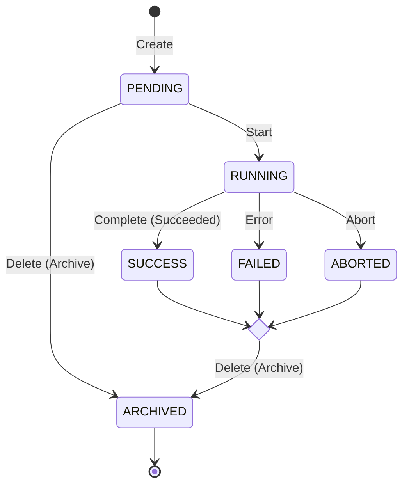

# Experiment and Feature Flags Service Specs (EFF)

This document serves as a critical, living template designed to equip agents with a rapid and comprehensive understanding of the codebase's architecture, enabling efficient navigation and effective contribution from day one. Update this document as the codebase evolves.


## Business Context

The software component features a scalable web experimentation engine aimed at bridging the gap between business and technical operations. Exposed through a RESTful interface and a Python SDK, this architecture facilitates seamless client-side integration, optimizing the deployment and monitoring throughout the experimentation lifecycle

## Software Architecture

This section describe a High level de software architecture for the EFF Component.

## Project Structure

This section provides a high-level overview of the project's directory and file structure, categorised by architectural layer or major functional area. It is essential for quickly navigating the codebase, locating relevant files, and understanding the overall organization and separation of concerns.

```
/part2_ab_testing
│
├── /specs                       # API Contracts (Source of Truth)
│   ├── /openapi                 # OpenAPI 3.0/3.1 definitions
│   │   ├── index.yaml           # Main entry point
│   │   └── /examples            # Mock data for documentation and testing
│   └── ARCHITECTURE.md          # This document, reference architecture. AGENTS MUST NOT MODIFY IT
│
├── /app                         # Backend Implementation
│   ├── __init__.py
│   ├── main.py                  # App entry point and spec loading
│   ├── /api                     # Route handlers (Controllers)
│   │   ├── /v1                  # API Versioning
│   │   │   ├── router.py        # Centralized router inclusion
│   │   │   └── /endpoints       # Business logic wiring per route
│   ├── /core                    # Global settings and security
│   ├── /models                  # Database entities (SQLAlchemy/SQLModel)
│   ├── /schemas                 # Data Transfer Objects (Pydantic)
│   │   # In SDD, these should match the /specs/openapi/components/schemas
│   └── /db                      # Database connection and session management
│
├── /lib                         # Module with clients for the API for easy use in external apps
├── /tests                       # Test suite
│   ├── /contract                # Tests to ensure implementation matches spec
│   └── /integration             # End-to-end API testing
└── Dockerfile
```

## Entities

### Entity `Experiment`:

```mermeid
classDiagram
    class Experiment {
        -name: String
        -id: String
        -hypothesis: String
        -description: String
        -is_feature_flag: bool
        -created_date: Date
        -start_date: Date
        -end_date: Date
        -state: String
    }

    class Variant {
        -control: bool
        -config: Dict
        -traffic: Float
    }

    Experiment "1" --> "2..N" Variant : variant
```

### Constrains:

#### Control Variant

An experiment must have at least two variants and exactly ONLY one control variant.

#### Traffic Consistency

For every experiment the sum of field `traffic` of all variants must be 1.0

*Formal Logic Constraint*

In terms of mathematical validation for your software component, the invariant is:
$$\sum_{i=1}^{n} \text{traffic}_i = 1.0$$

Where $n$ is the number of variants.

*Floating Point Precision:* Computers often struggle with exact sums of floats (e.g., 0.1+0.2=0.3). You should implement a Tolerance (Epsilon) check:

$$ abs(sum(traffic) - 1.0) < 1e-9 $$

This Epsilon parameter must be configurable.

Within the Hexagonal Architecture, this validation belongs in the Domain Model.
- Incoming Request: Validated against the JSON Schema (OpenAPI).
- Domain Invariant Check: A dedicated ExperimentValidator class checks the sum of traffic.
- Failure: If the sum is 0.99 or 1.01, return a 422 Unprocessable Entity error.

#### Variant Config Consistency

The configuration dictionary schema (`config`) for each variant of an experiment must be consistent with the configuration of the control variant.


#### User Assign mechanism

The method `GET /experiment/{id}/user/{user_id}/variant` must use the following class, that implements the user assignation mechanism:

```python
import hashlib

class ExperimentUserAssigner:
    def __init__(self, variants: list, epsilon: float = 1e-9):
        self.variants = variants
        self.total_traffic = sum(v['traffic'] for v in variants)
        
        if abs(self.total_traffic - 1.0) > epsilon:
            raise ValueError("the sum of traffic for all variants must be 1.0.")

        self.thresholds = []
        cumulative = 0.0
        for v in variants:
            cumulative += v['traffic']
            self.thresholds.append((cumulative, v['name']))

    def assign_variant(self, user_id: str) -> dict:
        """
        Assigns a variant in a deterministic wat using the user_id hash.
        """

        hash_object = hashlib.sha256(user_id.encode())
        hash_hex = hash_object.hexdigest()
        
        # using the first 8 digits
        hash_int = int(hash_hex[:8], 16)
        scale = hash_int / 0xFFFFFFFF  # norm to [0, 1)

        for threshold, variant_obj in self.thresholds:
            if scale < threshold:
                return variant_obj
        
        return self.variants[-1]
```


## Experiment Life Cycle State Machine

Below is a diagram showing the state machine that governs the life cycle of experiments.



## SDK for Developers

Create the class `/part2_ab_testing/lib/experiments_client.py` 

*Description*: Implementation of the ExperimentsClient class, responsible for interfacing with the experimentation service.

    *Initialization:* The constructor must support the configuration of the host parameter (the base URL of the service). Must download the experiment config using endpoint for `Get Experiment Details` after that, initalize the class `ExperimentUserAssigner` with the experiment variants.

    *Method:* get_variant(experiment_id: str, user_id: str) -> Dict

        Action: Call the method `assign_user` of the class `ExperimentUserAssigner`

        Return: The assigned variant (dict).

        Error Handling: Any communication failure or non-successful API response must propagate a descriptive exception.

    *Method:* `send_metric(experiment_id: str, user_id: str, metric_key: str, value: float)

        Action: Executes a POST request to the /experiment/{id}/user/{user_id}/metric endpoint.

        Resilience: This method must be "silent." In the event of an error, it must not interrupt the client application's execution flow; instead, it should log the incident for subsequent auditing.

## Development

### Unit Testing Using AAA Pattern

1. Arrange

This is the initialization phase. Here, you set up the specific conditions required for the test to run.
- Actions: Instantiate objects, initialize variables, mock dependencies, and define input data.
- Goal: To reach a known state before the "Act" occurs.

2. Act

This is the execution phase. You perform the specific operation or call the method you are intending to test.

- Actions: Invoke the "System Under Test" (SUT).
- Goal: To trigger the behavior that produces a result or state change.

3. Assert

This is the verification phase. You check whether the outcome of the "Act" matches your expectations.

- Actions: Compare the actual output with the expected output using assertion methods (e.g., assertEquals, isTrue).
- Goal: To determine if the test passes or fails.