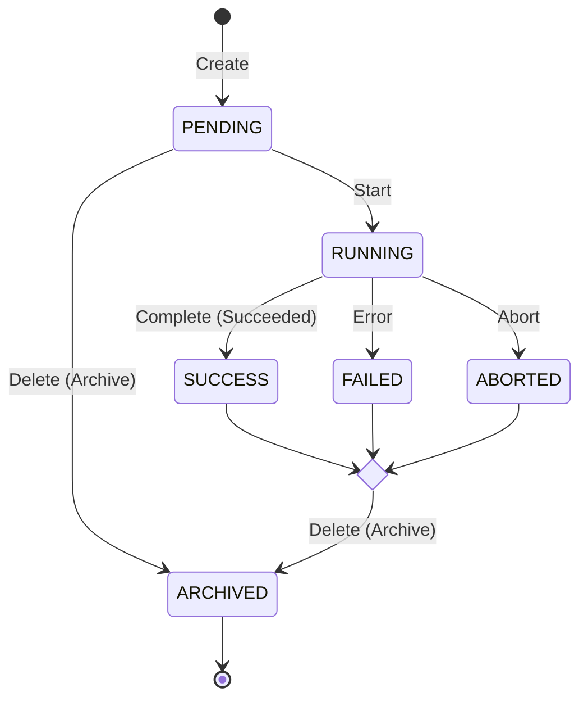

# Experiment and Feature Flags Service Specs

## Business Context

TODO

## Software Architecture

Highly recomended folder structure:

```
/part2_ab_testing
│
├── /specs                       # API Contracts (Source of Truth)
│   ├── /openapi                 # OpenAPI 3.0/3.1 definitions
│   │   ├── index.yaml           # Main entry point (references paths/components)
│   │   └── /examples            # Mock data for documentation and testing
│
├── /app                         # Backend Implementation
│   ├── __init__.py
│   ├── main.py                  # App entry point and spec loading
│   ├── /api                     # Route handlers (Controllers)
│   │   ├── /v1                  # API Versioning
│   │   │   ├── router.py        # Centralized router inclusion
│   │   │   └── /endpoints       # Business logic wiring per route
│   ├── /core                    # Global settings and security
│   ├── /models                  # Database entities (SQLAlchemy/SQLModel)
│   ├── /schemas                 # Data Transfer Objects (Pydantic)
│   │   # In SDD, these should match the /specs/openapi/components/schemas
│   └── /db                      # Database connection and session management
│
├── /tests                       # Test suite
│   ├── /contract                # Tests to ensure implementation matches spec
│   └── /integration             # End-to-end API testing
```

Entity `Experiment`:
```mermeid
classDiagram
    class Experiment {
        -name: String
        -id: String
        -hypothesis: String
        -description: String
        -start_date: Date
        -end_date: Date
    }

    class Variant {
        -control: bool
        -config: Dict
        -traffic: Float
    }

    Experiment "1" --> "2..N" Variant : variant
```
Constrains:

- For every experiment the sum of field `traffic` of all variants must be 1.0
Formal Logic Constraint

In terms of mathematical validation for your software component, the invariant is:
$$\sum_{i=1}^{n} \text{traffic}_i = 1.0$$

Where n is the number of variants.

Architectural Recommendation

Floating Point Precision: Computers often struggle with exact sums of floats (e.g., 0.1+0.2=0.3). You should implement a Tolerance (Epsilon) check:

$$ abs(sum(traffic) - 1.0) < 1e-9 $$

This epsilon must be configurable

Within your Hexagonal Architecture, this validation belongs in the Domain Model.

    Incoming Request: Validated against the JSON Schema (OpenAPI).

    Domain Invariant Check: A dedicated ExperimentValidator class checks the sum of traffic.

    Failure: If the sum is 0.99 or 1.01, return a 422 Unprocessable Entity error.

Experiment Life Cycle State Machine

